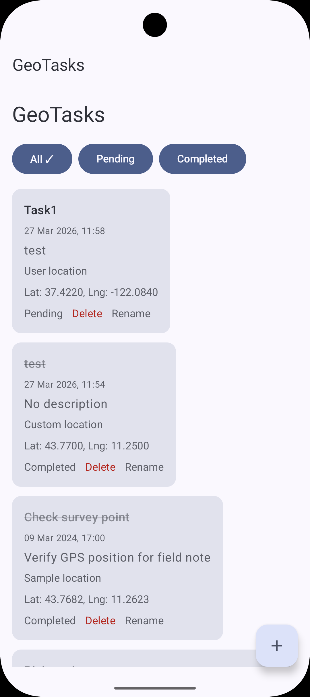
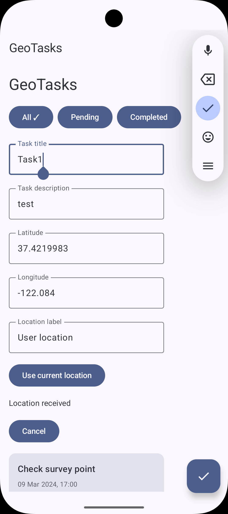

# GeoTasks

GeoTasks is an Android app built with Kotlin and Jetpack Compose to manage geolocated tasks with offline-first support.

## Features
- Add tasks with title, description and coordinates
- Use current device location
- Offline persistence with Room
- Mark tasks as completed
- Delete tasks
- Filter tasks (All / Pending / Completed)
- Snackbar feedback
- Animated UI with Compose
- Contextual Floating Action Button

## Tech Stack
- Kotlin
- Jetpack Compose
- MVVM
- StateFlow
- Room
- Material 3

## Architecture
The app follows a simple MVVM architecture:
- Compose UI for rendering
- ViewModel for UI state management
- Repository for data handling
- Room for local persistence

## Screenshots

## Future Improvements
- Google Maps integration
- Reverse geocoding
- Unit tests
- Task editing

## Purpose
This project was built to practice modern Android development using Compose and clean architecture principles.
